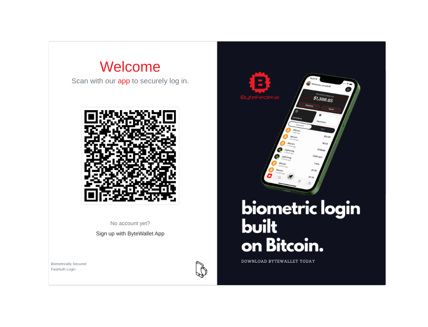

# ByteAuth-Laravel

## Description

ByteAuth-Laravel is a Laravel package that integrates Byte Federal's fast authentication system, leveraging bitcoin cryptographic standards, into your Laravel application. This package provides a seamless way to onboard users and enable secure sign-in functionalities, harnessing the robustness and security of bitcoin's cryptographic infrastructure. With ByteAuth-Laravel, you can easily implement a state-of-the-art authentication system in your Laravel projects.

## Features

- **Fast Authentication**: Utilize Byte Federal's rapid authentication process to enhance user experience.
- **Bitcoin Cryptographic Standards**: Benefit from the high security of bitcoin cryptographic practices.
- **Easy Integration**: Seamlessly integrate with Laravel applications, providing a Livewire component for both front-end and back-end operations.
- **Sample Login Page**: Get started quickly with a sample login landing page tailored for Laravel applications.
- **Webhook Support**: Includes a `WebhookController` for handling authentication callbacks.

## Installation

This package requires `simplesoftwareio/simple-qrcode`. If it's not already installed, you can install it by running:

```bash
composer require simplesoftwareio/simple-qrcode
```

To install ByteAuth-Laravel, run the following command in your Laravel project:

```bash
composer require bytefederal/byteauth-laravel
```

After installing the byteauth-laravel package, you may publish the QR Code's configuration file using:

```bash
php artisan vendor:publish --provider="SimpleSoftwareIO\QrCode\QrCodeServiceProvider"
```

## Configuration
After installation, publish the package's configuration file by running:

```bash
php artisan vendor:publish --provider="ByteFederal\\ByteAuthLaravel\\ByteAuthServiceProvider"
```
This will publish the ByteAuth-Laravel configuration file to your project's config directory. Edit this file as needed to match your application's requirements.

```bash
php artisan vendor:publish --tag=byteauth-views
```

This setup enables your application to use and potentially customize the included sample login page.

Make sure to add the following three routes to your `routes/api.php` file:

```bash
Route::post('/webhook/registration', [WebhookController::class, 'handleRegistration']);
Route::post('/webhook/login', [WebhookController::class, 'handleLogin']);
Route::get('/check', [WebhookController::class, 'check']);
```

or guest Route section. Make sure CORS rules allow the WebhookController to receive incoming posts. 

## Usage
To use ByteAuth-Laravel in your application, follow these steps:

- Route Setup: Import the package routes in your routes/api.php file.
- Use the sample landing page at a route of your convenience. It will offer your users a way to log into your site or register using ByteWallet
- To register your domain for free for this service go to wallet.bytefederal.com/web/login and register your domain, webhook url and API key.
- Enjoy a biometrically secured passwordless authentication system

Refer to the [documentation](https://fast.bytefederal.com) for detailed usage instructions.

Happy coding!

## Contributing
Contributions to ByteAuth-Laravel are welcome.

License
ByteAuth-Laravel is open-sourced software licensed under the MIT license.
